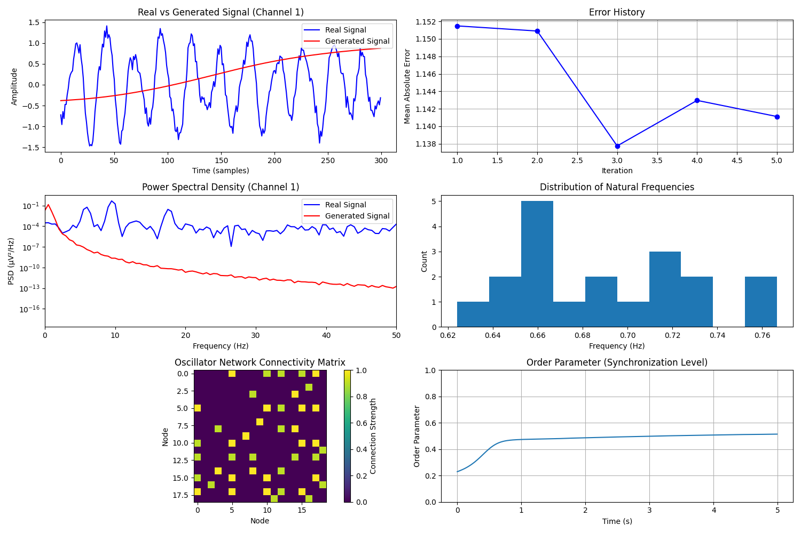

# CerebralFlow: Neural Dynamics Simulation Framework


**CerebralFlow** is a comprehensive framework for modeling and simulating large-scale neural dynamics. It provides tools to reconstruct functional networks from signal data, validate connectivity using rigorous statistical methods (surrogates), and simulate brain activity using coupled oscillator models.

## Overview

CerebralFlow enables the creation of "digital twins" of brain dynamics. It processes physiological signals to extract connectivity and intrinsic frequencies, verifies them against null models, and then instantiates generative models to reproduce observed states.



* **Personalized Modeling**: Data-driven model construction.
* **Scientific Validation**: **Surrogate Data Analysis** and **Phase Lag Index (PLI)** for robust connectivity.
* **Simulation Engine**: Efficient simulation of neural mass and oscillator networks.
* **Closed-Loop Control**: Optimization tools for model fitting and control parameter tuning.

## Key Features

* **Signal Analytics**: Hilbert transform-based phase extraction and frequency estimation.
* **Scientific Rigor**:
  * **Surrogate Analysis**: Phase-shuffling to test statistical significance of connectivity.
  * **Advanced Metrics**: Phase Lag Index (PLI) and Weighted PLI (wPLI) to mitigate volume conduction.
* **Simulation Models**:
  * **MassNeuralDynamics**: Mean-field approximations of neural populations.
  * **DynamicOscillatorNetwork**: Time-varying Kuramoto models for synchronization studies.
* **Connectivity Analysis**: Functional connectivity estimation from time-series data.
* **Dithered Control**: Simulation of external stimulation effects.

## Installation

```bash
git clone https://github.com/cerebralflow/cerebralflow.git
cd cerebralflow
pip install -e .
```

To install development dependencies (testing, linting):

```bash
pip install -e .[dev]
```

## Quick Start

### Running the Example Pipeline

CerebralFlow includes a comprehensive example pipeline that generates synthetic data, performs analysis (with statistical validation), and runs a simulation.

```bash
# Run with default settings
python examples/run_pipeline.py

# Custom settings
python examples/run_pipeline.py --duration 5 --channels 10 --output my_results.png
```

### Script Usage

```python
import numpy as np
from cerebral_flow.signals.data_inversion import SignalInverter
from cerebral_flow.simulation.neural_mass import MassNeuralDynamics
from cerebral_flow.analytics.surrogates import SurrogateGenerator, SignificanceTester
from cerebral_flow.analytics.advanced_metrics import phase_lag_index

# 1. Load data
data = np.load('subject_data.npy') # shape: (n_channels, n_samples)
fs = 256

# 2. Invert signals & Validate
inverter = SignalInverter(sampling_rate=fs)
inverter.load_data(data)
connectivity = inverter.assess_connectivity()

# 2.1 Statistical Validation (New!)
surrogate_gen = SurrogateGenerator(data, fs)
surr_conn_means = [np.mean(inverter.assess_connectivity()) for _ in surrogate_gen.phase_shuffle(20)]
p_val, _ = SignificanceTester.calculate_p_value(np.mean(connectivity), surr_conn_means)
print(f"Connectivity Significance: p={p_val}")

# 2.2 Advanced Connectivity (PLI)
phases = inverter.compute_hilbert_phase()
pli = phase_lag_index(phases.T) # Robust connectivity matrix

# 3. Initialize Dynamics
frequencies = inverter.derive_natural_frequencies()
model = MassNeuralDynamics(
    n_nodes=data.shape[0],
    connectivity=pli, # Use robust PLI connectivity
    frequencies=frequencies
)
```

## Example Output

```text
Starting CerebralFlow Framework Pipeline
Data split: Training (10, 1024), Validation (10, 256)

Step 1: Signal Data Inversion
  Extracted phases shape: (10, 1024)
  Estimated frequencies: mean=10.12 Hz

Step 1.5: Statistical Validation (Surrogates)
  Generating 20 phase-shuffled surrogates...
  Observed Mean Connectivity: 0.4215
  Surrogate Mean (N=20): 0.4208
  Z-score: 0.15, p-value: 0.4500
  Result is NOT statistically significant (Expected for random noise)

Step 1.6: Advanced Connectivity (PLI)
  PLI Matrix Mean: 0.3805

...

Step 9: Closed-Loop Optimization
  Optimization complete. Final Error: 1.0520

Pipeline completed successfully!
```

## Documentation

* **`cerebral_flow.signals`**: Signal processing and inversion tools.
* **`cerebral_flow.simulation`**: Core simulation models.
* **`cerebral_flow.analytics`**: Analysis and metrics (including `surrogates` and `advanced_metrics`).
* **`cerebral_flow.common`**: Utilities and helpers.
